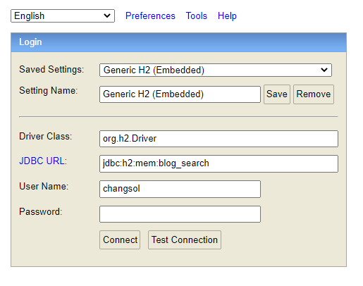

# Blog Search API SERVER

## 1. Requirements

- 블로그 검색 API
  - [x] 키워드 검색 기능
  - [x] 정렬(정확도순, 최신순) 기능
  - [x] Response는 Pagination 형태
  - [x] 블로그 검색 API는 KAKAO, NAVER OPEN API 활용 (그 외 추가 가능)
  - [x] 동시성 제어 처리 
- 인기 검색어 API
  - [x] 많이 검색된 키워드 TOP 10 제공 (입력하는 키워드 필터링 기능도 추가)

## 2. Environment

### 1) 개발 환경
- 기본 사용 포트 : 8080
- 코드컨벤션 : chang_sol_code_style.xml 참고
- JAVA 16
- SpringBoot 2.6.6
- JPA (Spring Data JPA)
- Hibernate 5.6.5.Final (query issue 로 인한 다운그레이드 root build.gradle 참고)

```
configurations.configureEach {
        resolutionStrategy.eachDependency { DependencyResolveDetails details ->
            if (details.requested.group == 'org.hibernate' && details.requested.name == 'hibernate-core') {
                details.useVersion '5.6.5.Final'
                details.because 'hibernate 5.6.7.Final query error issue. 5.6.5.Final downgrade'
            }
        }
    }
```

- H2 DB (module-core yml 참고)

```yaml
  h2:
    console:
      enabled: true  # H2 console 사용
      path: /h2  # console 경로

  #DB설정
  datasource:
    #h2 드라이버 설정
    driver-class-name: org.h2.Driver
    #사용할 DB URL (Connection)
    url: jdbc:h2:mem:blog_search
    username: changsol  #ID
    password: changsol^_^3  #PWD
```

- SpringDoc를 통한 OpenAPI(3.0) swagger 

```yaml
#SrpingDoc 설정 API 문서화
springdoc:
  version: 0.0.1
  api-docs:
    path: /api-docs
  #Media Type 기본 값을 application/json
  default-consumes-media-type: application/json;charset=UTF-8
  default-produces-media-type: application/json;charset=UTF-8
  cache:
    disabled: true
  swagger-ui:
    #api 및 태그 정렬 기준을 알파벳 오름차순
    operations-sorter: alpha
    tags-sorter: alpha
    path: /swagger-ui
    #swagger-ui default url인 petstore html 문서 비활성화 여부
    disable-swagger-default-url: true
    display-request-duration: true  # try it out 을 했을 때 request duration 을 추가로 찍어줌
  #OpenAPI 3 로 문서화할 api path 리스트
  paths-to-match:
    - /v1/**
```

```java

@Component
public class SwaggerConfig {

	@Bean
	public OpenAPI openAPI(@Value("${springdoc.version}") String appVersion) {
		Info info = new Info()
			.title("Changsol Blog Search API")
			.version(appVersion)
			.description("창솔 블로그 검색 서비스에 오신걸 환영합니다.😁")
			.contact(new Contact().name("changsol-github").url("https://github.com/ChangSol"))
			.license(new License().name("Apache License Version 2.0")
								  .url("http://www.apache.org/licenses/LICENSE-2.0"));

		return new OpenAPI()
			.components(new Components())
			.info(info);
	}
}
```

### 2) 외부 라이브러리

- Lombok 1.18.20 (보일러플레이트 처리)
- MapStruct 1.5.2 (Data Mapper로 사용)

### 3) 모듈 구조

- module-core : 도메인 모듈
- module-external : 외부 API 통신 모듈
- module-search : 블로그 검색 모듈

### 4) Domain Model

- 검색어 관리 테이블
```h2
create table blog_search_keyword
(
    keyword    varchar(255)     not null, -- 검색어
    created_at timestamp,                 -- 생성시간
    updated_at timestamp,                 -- 수정시간
    count      bigint default 0 not null, -- 검색 횟수
    version    integer,                   -- optimistic rock version
    primary key (keyword)
)
```
- 오류 로그 관리 테이블
```h2
create table error_log (
       id bigint generated by default as identity, -- 일련번호
        created_at timestamp, -- 생성시간
        updated_at timestamp, -- 수정시간
        data clob, -- 요청 데이터
        error_class varchar(255), -- 오류 클래스명
        error_message clob, -- 오류 메시지
        method varchar(255), -- 오류 API Method
        origin clob, -- origin url
        query clob, -- 요청 query
        remote_addr varchar(255), -- 요청 IP
        request_uri clob, -- 요청 uri
        status varchar(255), -- 오류 상태
        status_code integer, -- 오류 상태 코드
        user_agent varchar(255), -- 요청 기기 정보
        primary key (id)
    )
```

## 3. 응답 및 오류

- 코드 정의

<table>
  <tr>
    <td>코드</td>
    <td>설명</td>
  </tr>
  <tr>
    <td>200</td>
    <td>성공</td>
  </tr>
  <tr>
    <td>500</td>
    <td>Server Error</td>
  </tr>
  <tr>
    <td>400</td>
    <td>잘못된 요청</td>
  </tr>
  <tr>
    <td>404</td>
    <td>리소스를 찾을 수 없음</td>
  </tr>
  <tr>
    <td>409</td>
    <td>요청 데이터에 대한 충돌</td>
  </tr>
</table>

- 오류 코드 상세

<table>
  <tr>
    <td>클래스</td>
    <td>코드</td>
    <td>설명</td>
    <td>예시</td>
  </tr>

  <tr>
    <td>각종클래스</td>
    <td>500</td>
    <td>각종 오류 클래스에 대한 처리</td>
    <td>

  ```json
  {
    "timestamp": "2023-03-21 14:03:50.156",
    "status": "INTERNAL_SERVER_ERROR",
    "statusCode": 500,
    "errorClass": "org.springframework.web.server.ServerErrorException",
    "errorMessage": "500 INTERNAL_SERVER_ERROR \"500 error test\"",
    "fieldErrors": []
  }
  ```

  </td>
  </tr>

  <tr>
    <td>WebClientException</td>
    <td>502</td>
    <td>WebClient 통신 오류 4xx 발생 시</td>
    <td>

  ```json
  {
    "timestamp": "2023-03-21 21:25:29.238",
    "status": "BAD_GATEWAY",
    "statusCode": 502,
    "errorClass": "org.changsol.exceptions.WebClientException",
    "errorMessage": "{\"errorType\":\"AccessDeniedError\",\"message\":\"appKey(9b52e53084225d4c6983c1f4e245794f) is already deactivated\"}",
    "requestUri": "/v1/blogs",
    "fieldErrors": []
  }
  ```

  </td>
  </tr>

  <tr>
    <td>BadRequestException</td>
    <td>400</td>
    <td>잘못된 요청</td>
    <td>

  ```json
  {
    "timestamp": "2023-03-21 21:16:46.637",
    "status": "BAD_REQUEST",
    "statusCode": 400,
    "errorClass": "org.changsol.exceptions.BadRequestException",
    "errorMessage": "요청하신 페이지의 데이터가 존재하지 않습니다.",
    "requestUri": "/v1/blogs",
    "fieldErrors": []
  }
  ```
  </td>
  </tr>

  <tr>
    <td>BindException</td>
    <td>400</td>
    <td>요청 데이터에 대한 유효성 검증 오류</td>
    <td>

  ```json
  {
    "timestamp": "2023-03-21 04:07:25.276",
    "status": "BAD_REQUEST",
    "statusCode": 400,
    "errorClass": "org.springframework.validation.BindException",
    "errorMessage": "Binding Error",
    "fieldErrors": [
      {
        "fieldName": "keyword",
        "errorMessage": "검색 키워드는 필수입니다."
      },
      {
        "fieldName": "blogSortType",
        "errorMessage": "정렬 방식은 필수입니다."
      }
    ]
  }
  ```
  </td>
  </tr>

  <tr>
    <td>NotFoundException</td>
    <td>404</td>
    <td>리소스를 찾지 못하는 오류</td>
    <td>

  ```json
  {
    "timestamp": "2023-03-21 04:07:25.276",
    "status": "BAD_REQUEST",
    "statusCode": 400,
    "errorClass": "org.springframework.validation.BindException",
    "errorMessage": "Binding Error",
    "fieldErrors": [
      {
        "fieldName": "keyword",
        "errorMessage": "검색 키워드는 필수입니다."
      },
      {
        "fieldName": "blogSortType",
        "errorMessage": "정렬 방식은 필수입니다."
      }
    ]
  }
  ```

  </td>
  </tr>
</table>

## 4. 테스트 케이스

## 5. 실행 및 API Docs
### 1) 실행 방법
- Executable jar download url :
- 실행 명령어 (기본 8080 port)

```
java -jar blog-search-service-0.0.1-SNAPSHOT.jar
```

- 실행 명령어 (다른 port 사용 시)

```
java -jar "-Dserver.port=사용할포트" blog-search-service-0.0.1-SNAPSHOT.jar
```
### 2) API Document
- API Docs url : http://localhost:8080/swagger-ui

[보여지는 텍스트](#이동할위치의텍스트)
~생략~
#이동할위치의텍스트

### 3) H2 DB
- consol url : http://localhost:8080/h2
  
- 계정 : [H2 DB 관련 내용 참고](#2-environment)
 